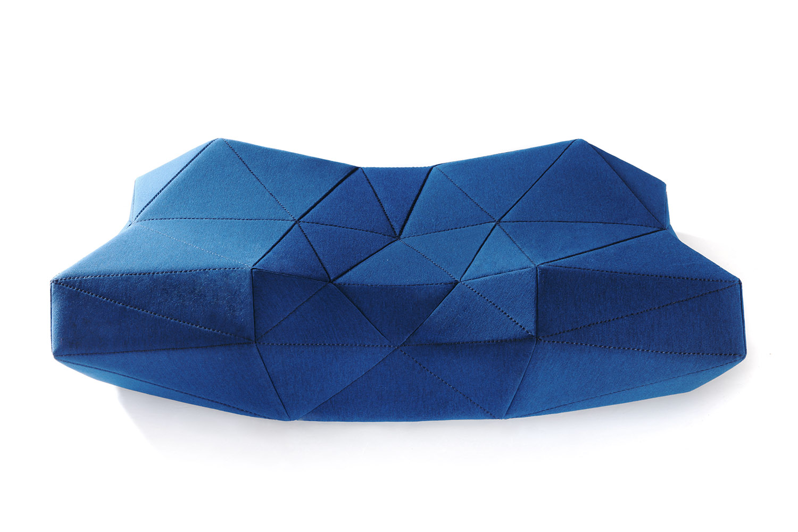
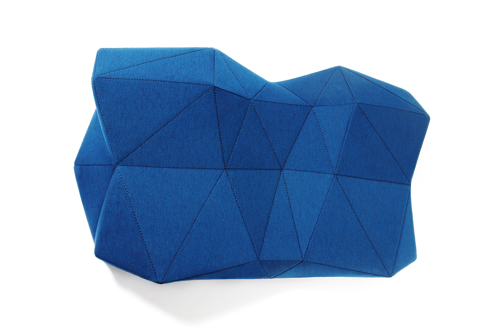
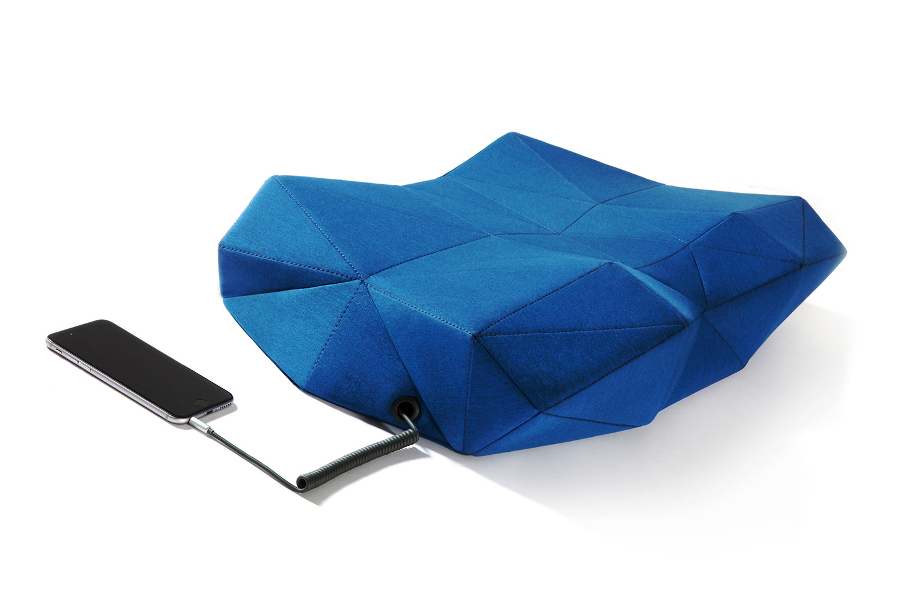
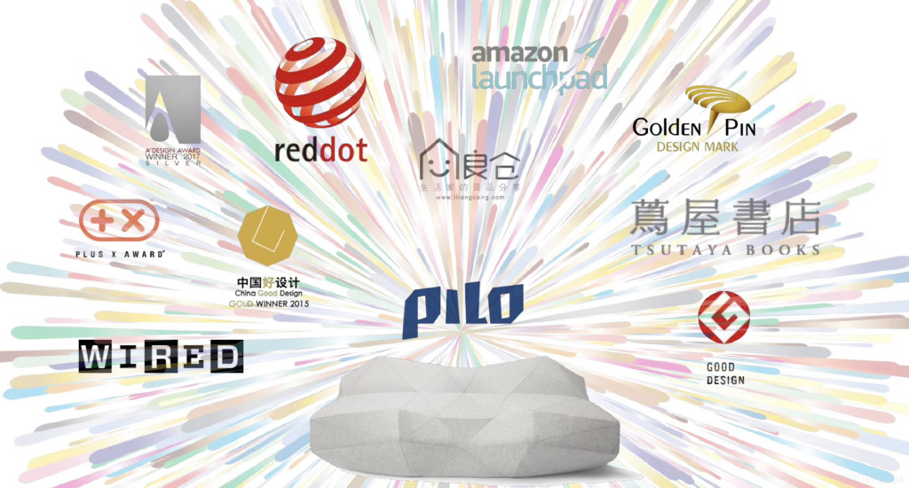

# PILO

**Sound Sleep with Sound**

**[Interactive 3D Viewer](https://djzoom.github.io/PILO/)**

  

PILO is an ergonomic smart pillow with a Low Poly surface of 52 facets, each computed from human body data to support back, side, and prone sleeping positions. Hidden stereo speakers deliver immersive sound — ocean waves, forest rain, original music — directly through the pillow, with no headphones and no disturbance to your partner.

Designed by Zhong Wang. Made by Soundario Inc.

---

## Logo

Vector SVG logo with rounded-corner geometric letterforms, measured from the original design file.

| Variant | File | Use |
|---------|------|-----|
| Navy | [`logo/pilo-logo.svg`](logo/pilo-logo.svg) | Light backgrounds (`#002f6c`) |
| White | [`logo/pilo-logo-white.svg`](logo/pilo-logo-white.svg) | Dark backgrounds (`#ffffff`) |

---

## Design

  

The 52 polygonal facets are not decorative. Each angle and ridge is derived from ergonomic data — head weight distribution, neck curvature, shoulder clearance, arm placement across all major sleep positions. The closed-manifold topology (V=31, E=81, F=52, χ=2) ensures continuous structural support with no dead zones.

**Memory Foam Core** — Slow-rebound foam that molds to head shape and weight over time.

**Three-Layer Pillowcase** — High-count cotton (breathable) + polymer isolation (cool in summer, warm in winter) + high-damping fiber (anti-slip). Removable and washable.

## Sound

  

Invisible stereo drivers are embedded in the foam core, creating a personal sound field audible only to the sleeper. Connect via 3.5mm audio cable to any phone or player — no charging needed.

The companion app provides curated sleep content: independent musicians, ASMR, and field recordings captured at oceans, forests, lakes, and fireplaces around the world.

## Awards

  

| Award | Year |
|-------|------|
| Red Dot Design Award | 2016 |
| A' Design Award, Silver | 2016–2017 |
| China Good Design, Gold | 2015 |
| Golden Pin Design Award | 2018 |
| Plus X Award | — |
| Good Design Award | — |

Featured in **WIRED**, **Amazon Launchpad**, **TSUTAYA Books**.

## 3D Model

The complete mesh — 32 vertices, 60 triangles, 52 product facets — is included in multiple formats:

| Format | File | Use |
|--------|------|-----|
| OBJ | [`models/pilo_52.obj`](models/pilo_52.obj) | 3D editors, renderers |
| STL | [`models/pilo_52.stl`](models/pilo_52.stl) | 3D printing |
| PLY | [`models/pilo_blue.ply`](models/pilo_blue.ply) | Colored mesh (blue) |
| PLY | [`models/pilo_grey.ply`](models/pilo_grey.ply) | Colored mesh (grey) |
| SVG | [`models/pilo_wireframe.svg`](models/pilo_wireframe.svg) | 2D wireframe |
| Python | [`models/rebuild_pilo.py`](models/rebuild_pilo.py) | Rebuild mesh from vertex data |

### Interactive Viewer

The **[3D Viewer](https://djzoom.github.io/PILO/)** runs in-browser (Three.js):

- **Click** the pillow to poke it — memory foam physics simulation
- **Rebound** — slow-recovery material demo
- **Wire** — mesh topology with labeled vertices
- **Rotate** — auto-rotate

## Documents

- [Product Introduction (PDF)](docs/PILO_introduction.pdf)
- [Design Patent — CN201530265572](docs/design-patent-CN201530265572.pdf)
- [Utility Patent — CN201520678090X](docs/utility-patent-CN201520678090X.pdf)

---

## Rights & Patents

**This repository is NOT open source.** All content — including the PILO design, 3D models, logo, images, and documentation — is the intellectual property of Zhong Wang (王众) and Soundario Inc., which he founded.

PILO is a patented product:
- **Design Patent** — [CN201530265572](docs/design-patent-CN201530265572.pdf)
- **Utility Patent** — [CN201520678090X](docs/utility-patent-CN201520678090X.pdf)

This repository is made publicly available for reference and demonstration purposes only. No license is granted for commercial use, reproduction, modification, or distribution of any materials contained herein without explicit written permission from Zhong Wang or Soundario Inc.

---

© Zhong Wang / Soundario Inc.
